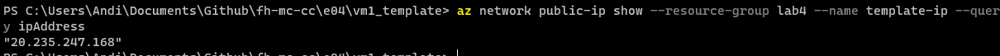
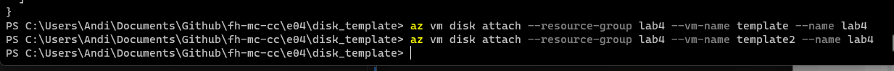

= Lab 4 Azure
:author: Andreas Wenzelhuemer
:email: <s2210455024@fhooe.at>
:reproducible:
:experimental:
:listing-caption: Listing
:source-highlighter: rouge
:toc:
:numbered:
:toclevels: 5
:rouge-style: github

<<< 
== Azure Portal

=== Preparations

.Ressource group for the lab
 

.Updated dashboard
 

AWS vs Azure naming:

- EC2 instances -> Virtual Machines
- Security Groups -> Network Security Groups
- Volumes -> Disks
- Snapshots -> Snapshots
- Load Balancers -> Load Balancer
- Target Groups -> Network Security Group Rules

<<<
== Azure CLI

.Login
 

<<<
== Azure Resource Manager (ARM) Templates

=== Creating an Initial Template

.Initial template
 

.Template view of Azure
 

=== Analyzing an ARM Template

Parameters: Can be used to customize the deployment of the solution

Variables: Are used to simplify the template, eliminate duplication, and make the template easier to read and maintain.

Resources: Contains an array of objects, each representing a resource that you want to deploy with the template.

Outputs: Defines the values that can be returned from the ARM template after deployment. These outputs can be used to retrieve information about deploy resources, such as the the IP address of a VM.

Create a new key with `ssh-keygen -t rsa` and add it to the template.json file.

.Replace public key in template.json

Now in the next step can deploy the template using the azure cli.

=== Creating a VM using the CLI

`az deployment group create -g lab4 --template-file template.json --parameters parameters.json`

Because we added a public key to the template we can now connect to the vm using ssh without using a password or key file.

Connect to the VM using SSH:

`ssh azureuser@20.244.34.101`

.Running vm deployment
 

List all vms with name template:

`az vm list --query "[?name=='template']"`

.List VMs
image::2024-01-15T11-40-14-935Z.png[] 

List all vms with public ips:

`az network public-ip list`

.VMs with public Ips
 

Get public ip address:

`az network public-ip show --resource-group lab4 --name template-ip --query ipAddress`

.Public ip address
 

<<<
== Web Server Access

=== Installing the Web Server

Install webserver:

`sudo apt-get install apache2`

.Check installation
 

==== Check accessibility

.Accessible
 

.Not accessible
 

==== Add NSG rule for Web Server

.Network security group name
 

List the security groups:

`az network nsg list --query "[?name=='template-nsg']"`

Add an nsg rule to the group to allow tcp access from port 80:

`az network nsg rule create --resource-group lab4 --nsg-name template-nsg --name http-rule --protocol tcp --priority 100 --source-address-prefix '*' --source-port-range '*' --destination-address-prefix '*' --destination-port-range 80`

==== Modifying NSG rules

Remove rule:

`az network nsg rule delete --resource-group lab4 --nsg-name template-nsg --name http-rule`

Allow from own ip only:

`az network nsg rule create --resource-group lab4 --nsg-name template-nsg --name ip-rule --protocol tcp --priority 100 --source-address-prefix '77.220.105.192/32' --source-port-range '*' --destination-address-prefix '*' --destination-port-range 80`

.Works again
 

Remove rule:

`az network nsg rule delete --resource-group lab4 --nsg-name template-nsg --name ip-rule`

Allow from subnet:

`az network nsg rule create --resource-group lab4 --nsg-name template-nsg --name subnet-rule --protocol tcp --priority 100 --source-address-prefix '77.220.105.0/32' --source-port-range '*' --destination-address-prefix '*' --destination-port-range 80`

Selecting a port range:

`az network nsg rule create --resource-group lab4 --nsg-name template-nsg --name portrange-rule --protocol tcp --priority 100 --source-address-prefix '*' --source-port-range '*' --destination-address-prefix '*' --destination-port-range 80-443`

<<<
== Creating more VMs using ARM

.Set password instead of public key
 

.Allow password sign in
 

All public ip stuff was removed from parameters.json and template.json.

Create the vm using the cli:

`az deployment group create -g lab4 --template-file template.json --parameters parameters.json`

.Running vm deployment
 

Query vm:

`az vm list --query "[?name=='template2']"`

.Template2 VM
 

Query nic list:

`az network nic list --query "[?name=='template804_z2']"`

.Private ip of vm
 

Connect to second vm over first vm with ssh:

.Connect to second vm
 

<<<
== Disks

=== Creating the Disk

`az disk create --name lab4 --sku Premium_LRS --size-gb 1024 --max-shares 2 --resource-group lab4 --location centralindia --zone 1`

 

Create with disk template:

`az deployment group create --ressource-group lab4 --template-file template.json --parameters parameters.json`

=== Attaching the Disk

First shutdown running vms:

`az vm deallocate --name template --resource-group lab4`

`az vm deallocate --name template2 --resource-group lab4`

Attach disk to both vms:

`az vm disk attach --resource-group lab4 --vm-name template --name lab4`

`az vm disk attach --resource-group lab4 --vm-name template2 --name lab4`

.Connect to both disks
 

Create filesystem on one VM:

.Create filesystem
 

.Mount to folder /fileserver
 

Create file and unmount disk:

.Create file and unmount
 

Connect to second vm and mount disk:

.Mount disk and check for file
 

// If time add mpi task

// <<<
// == MPI on Azure

// === Requirements Overview

// === Create Hosts

// === Install MPI

// === Hosts File

// === Authentication

// === NFS

// === Hosts for MPI

// === Testing