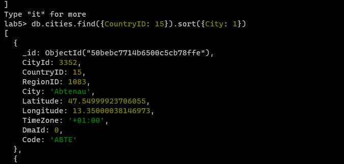

= Lab 5 NoSQL
:author: Andreas Wenzelhuemer
:email: <s2210455024@fhooe.at>
:reproducible:
:experimental:
:listing-caption: Listing
:source-highlighter: rouge
:toc:
:numbered:
:toclevels: 5
:rouge-style: github

<<<

== MongoDB

=== Setup

Install MongoDB Community Server:

.Install Community Server

.Installation
image::img/2024-01-22-09-39-21.png[]

Install Database Tools with winget:

`winget install -e --id MongoDB.DatabaseTools`

Start database with following command from "C:\Program Files\MongoDB\Server\7.0\bin":

`.\mongod.exe`

After starting the database we connect via MongoDb Compass:

.Starting the Database

.Connected Database

.Default connection settings for localhost

Stopping the server is possible with:

`net stop MongoDB`

.Stopping the Database

=== Import Data

Create new database and collection

.Database

Create missing collections and add corresponding data from "dataset.zip".

.Imported data

=== Query Data

Connect via `mongosh`.
Switch database with `use lab5`.

==== Select all Austrian cities (countryID = 15)!

.All Austrian cities

==== Select all Austrian cities in ascending order!

.Ascending

==== Select all Austrian cities in descending order!

.Descending

==== Select the number of Austrian cities that are included in the dataset!

.Count

==== Select solely the city names of all Austrian cities!

.City names

==== Select all countries, which exhibit a population between 15 and 20 millions of people!

.Population

<<<
=== Update Data

==== Increase the population of Austria (countryID = 15) by 3 persons.

.Increased population

==== Decrease the population of Austria by 3 persons.

.Decreased population

<<<
== Azure Cosmos DB

=== Setup Cosmos DB

Select Azure Cosmos DB for MongoDB.

.Select database

.Azure Cosmos DB Configuration

.Created Azure Cosmos DB

=== Migrate Data

==== Export Data from MongoDB

.Dump

==== Upload all the files to a Storage Account

Create storage account and upload dump.
Change access and find storage url.

.Create Storage account

.Add blob storage container

.Upload dump

.Enable public access
image::img/2024-01-23-14-29-38.png[]

.Find storage url

==== Azure Database Migration Service (offline)

Create migration service, add a new project and upload the dump from the storage account.

.Create Azure Database Migration Service

.Create Azure Database Migration Project

.Offline Migration

.Database Selection

.Running Migration

.Imported Data

==== Query/Update Data

.Query for all Austrian cities

.List cities

Executing a couple times

.Update population
image::img/2024-01-23-14-19-38.png[]